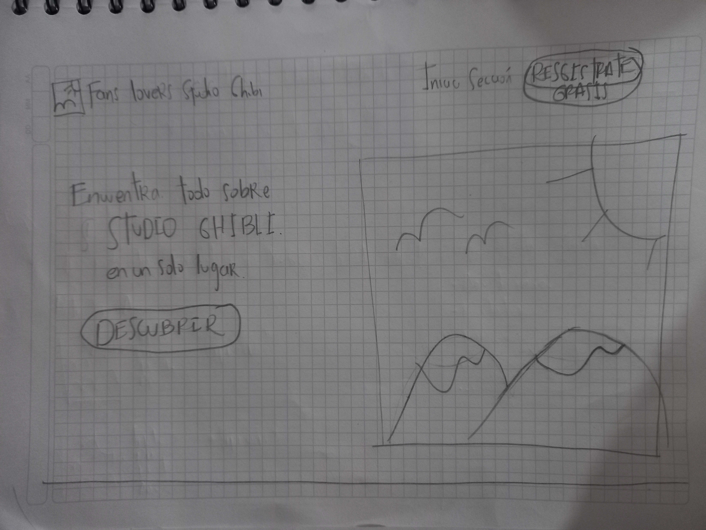
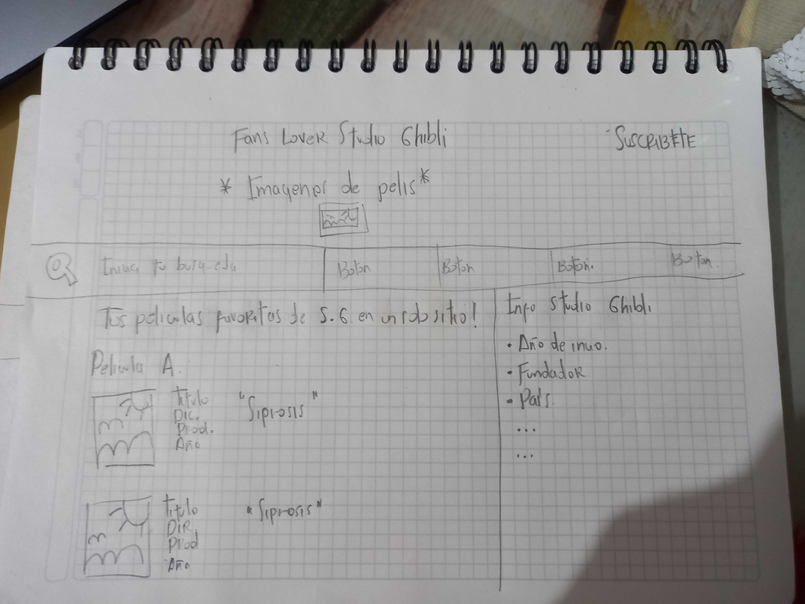
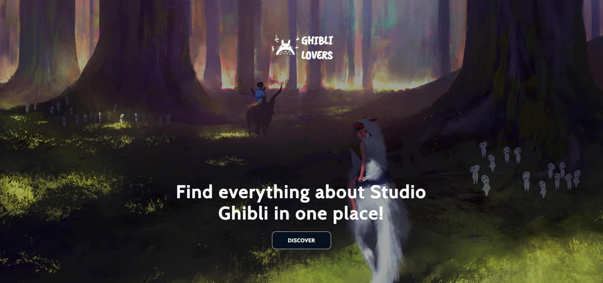
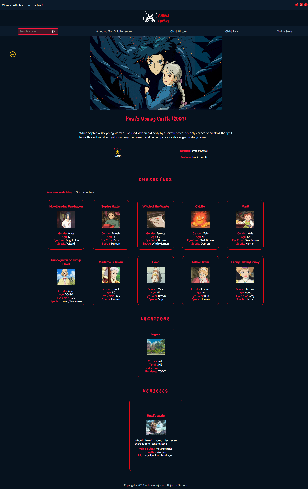

# Data Lovers - Studio Ghibli

## Índice

* [1. Definición del Proyecto](#1-definición-del-proyecto)
* [2. Investigación UX](#2-investigación-ux)
* [3. Diseño UI](#3-diseño-ui)
* [4. Interfaz de Usuario](#4-interfaz-de-usuario)

## 1. Definición del Proyecto

Studio Ghibli es considerado uno de los mejores estudios de animación a nivel mundial.Fundado en Japón en 1985,
ha producido una impresionante colección de películas que transportan al espectador a mundos mágicos e imaginativos.

En nuestra página "Ghibli Lovers Fan Page", encontrarán un espacio dedicado a explorar a todo lo relacionado con
las creaciones de Studio Ghibli: desde información detallada sobre las películas, año de lanzamiento, sus directores,
productores y muchas curiosidades del mundo Ghibli.

Ya sea que seas un fanático de Studio Ghibli de toda la vida o simplemente estés buscando una buena película para
disfrutar, estamos seguros de que encontrarás algo que te encantará en nuestra colección de posters. Sumérgete en la 
magia de Studio Ghibli y descubre por qué estas películas son tan queridas en todo el mundo.

¡Bienvenido a Ghibli Lovers Fan Page!

## 2. Investigación UX

### 2.1 ¿Quiénes son los principales usuarios de producto?
Son personas con un alto o pequeño interés en la animación japonesa, que pueden haber visto sólo una película que le haya 
encantado y quiere seguir viendo las demás animaciones de Studio Ghibli. Las animaciones de Studio Ghibli esta dirigido
a personas adultas, aunque al ser dibujos animados, también son consumidos por un público infantil.

### 2.2 ¿Cuáles son los objetivos de estos usuarios en relación con el producto?
Poder desarrollar experticia o ampliar sus conocimientos en las animaciones de Studio Ghibli, y poder compartir a otras
personas con el mismo interés o a alquien que este adentrando por primera vez a la animación japonesa.

### 2.3 ¿Cuáles son los datos más relevantes que quieren ver en la interfaz y por qué?

Se desea visulizar todas las películas realizadas por Studio Ghibli y que cada una de ellas tenga una información 
detallada, porque se quiere obtener más conocimiento como: año de lanzamiento, quienes realizaron las películas,
sus personajes, vehículos, etc.

### 2.4 ¿Cuándo utilizan o utilizarían el producto?
Se utilizaría en tiempos libres, de ocio y procrastinación, para hacer trabajos, exposiciones, obras teatrales 
donde requieran ver para poder tener información.

## 3. Diseño UI

### 3.1 Historias de Usuario
La creación de nuestra página se fundamentó principalmente en las opiniones y los comentarios realizados en 
entrevistas con conocedores en el estudio, así como a personas comunes interesadas en su obra. Para recopilar
todos los comentarios y opiniones se crearon "Historias de Usuario" que resume y presenta las peticiones de
los entrevistados con el fin de comprender las necesidades y deseos de nuestros usuarios y mejorar la
experiencia en nuestra página.

#### Historia Uno
- Yo cómo: Nuevo fan de Studio Ghibli.
- Quiero: Saber cuántas películas animadas hay y cuáles son.
- Para: Tener más conocimiento del contenido.
- Criterios de Aceptación:
    - Mostrar un mensaje de bienvenida.
    - Mostrar todas las películas con su respectiva imagen.
    - Mostrar un contador de la cantidad de las películas.
    - Insertar opciones para filtrar las películas alfabeticamente (A-Z) (Z-A).
- Definición de Terminado:
    - Crear un `<header>` para el mensaje de bienvenida.
    - Traer la data al `main.js`.
    - Mostrar la data en el `index.html`.
    - Incluir un `
` para el contador de películas y obtener el elemento por su id en el `main.js`.

#### Historia Dos
- Yo cómo: Nuevo fan de Studio Ghibli.
- Quiero: Saber quienes son los directores y productores de las animaciones y saber cuántas y cuáles son las animaciones a las que dieron "vida".
- Para: Tener más información de cada animación.
- Criterios de Aceptación:
    - Mostrar los directores.
    - Mostrar los productores.
    - Insertar un filtro y separar las películas según el director/productor seleccionado.
    - Mostrar el contador de películas según el director/productor seleccionado.
- Definición de Terminado:
    - Crear los filtros en el `main.js`
    - Generar un filtro general por director en el archivo `data.js` e importalo al `main.js`
    - Crear un `addEventListener` para que la data se filtre y se muestre en el `<html>` por director.
    - Generar un filtro general por productor en el archivo `data.js` e importarlo al `main.js`
    - Crear un `addEventListener` para que la data se filtre y se muestre en el `<html>` por productor.

#### Historia Tres
- Yo cómo: Usuario fan de Studio Ghibli.
- Quiero: Tener información relevante como descripción, fecha de lanzamiento, score, director, productor
y personajes de cada película.
- Para: Ser un fan que tiene más conocimiento de Studio Ghibli.
- Criterios de Aceptación:
    - Mostrar una descripción de cada película.
    - Mostrar la fecha de lanzamiento de cada película
    - Mostrar el score que tiene cada película.
    - Mostrar el director y productor.
    - Mostrar los personajes de cada película.
- Definición de Terminado:
    - Agregar contenedores en el `index.html` para poder crear una tercera página desde el `main.js`. 
    - Agregar con la data, la fecha de lanzamiento.
    - Agregar con la data, el score de cada pelicula.
    - Agregar con la data, la descripción de cada película.
    - Agregar con la data, el director y productor de cada película.
    - Mostrar los personajes con su nombre e imágen.
    - Crear un filtro en la página de posters, para que pueda ordenarlos por año (ascendente y descendente).

#### Historia Cuatro
- Yo cómo: Usuario fan de Studio Ghibli.
- Quiero: Saber cuántos y cuáles son los personajes de las animaciones.
- Para: Poder demostrar mi conocimiento a las personas que les interese los animes.
- Criterios de Aceptación:
    - Mostrar los personajes de cada pelicula (realizado en la HU anterior).
    - Mostrar un contador de la cantidad de personajes por película.
- Definición de Terminado:
    - Agregar al `main.js` un contador de personajes.

#### Historia Cinco
- Yo cómo: Usuario interesado en las películas animadas.
- Quiero: Saber que características tienen los personajes como: nombres, edad, género, especie, etc.
- Para: Obtener más conociminento de las animaciones.
- Criterios de Aceptación:
    - Mostrar los personajes y sus detalles como edad, género, especie, etc., de cada película.
- Definición de Terminado:
    - Agregarle al personaje sus detalles como edad, género, especie, color de ojos y de pelo.

#### Historia Seis
- Yo cómo: Usuario admirador de los paisajes y vehículos ilustrados o animados.
- Quiero: Saber cuáles son las locaciones y vehículos que tiene cada película.
- Para: Conocer como ilustraron en sus películas.
- Criterios de Aceptación:
    - Mostrar las locaciones de cada película.
    - Mostrar los vehículos utilizados en cada película.
- Definición de Terminado:
    - Crear en la tercera página cards con las locaciones y vehículos.
    - Por cada locación agregaremos su información como nombre, imagen, el clima, terreno, superficie de agua y habitantes.
    - Por cada vehículo agregaremos su información como nombre, imagen, descripción, clase, longitud y piloto.    

### 3.2 Prototipo de baja fidelidad
[Link al prototipo interactivo de Figma](https://www.figma.com/proto/AUvHq0MHcmJOp4PYmd6T7R/Studio-Ghibli?type=design&node-id=586-9&scaling=scale-down&page-id=55%3A3&starting-point-node-id=586%3A9)

### 3.3 Prototipo de alta fidelidad
[Link al prototipo interactivo de Figma - Primer Modelo](https://www.figma.com/proto/AUvHq0MHcmJOp4PYmd6T7R/Studio-Ghibli?type=design&node-id=627-6&scaling=scale-down&page-id=0%3A1&starting-point-node-id=627%3A6&show-proto-sidebar=1)

[Link al prototipo interactivo de Figma](https://www.figma.com/proto/AUvHq0MHcmJOp4PYmd6T7R/Studio-Ghibli?type=design&node-id=130-15&scaling=scale-down&page-id=0%3A1&starting-point-node-id=130%3A15)

### 3.4 Test de Usabilidad
A través de la retroalimentación recibida de nuestros usuarios se creo una lista con los posibles
cambios o inconvenientes de la página. Gracias a la lista se realizaron los cambios necesarios en
nuestra página para asegurarnos de que la experiencia sea lo mas gratificante para el usuario.

A continuación presentamos una lista que resumen las críticas que recibimos de nuestros usuarios:

- Cambiar la paleta de colores de la interfaz.
- Cambiar las imágenes de la página de inicio, los colores del texto y modelo de botón.
- Cambiar la forma de los posters de las películas para identificarlos mejor a cada uno.
- Retirar la cinta blanca que contiene el nombre de la película.
- Insertar un trailer de cada video, para dar a conocer más de que trata la película, con un pequeño
resumen y un botón para leer más acerca de la película seleccionada.
- Retirar las cards de ¿sabías qué? y frase Ghibli.
- Agregar una barra de navegación para saber más curiosidades de Studio Ghibli.
- Cambiar la posicion de los filtros.
- Retirar cards de los productores y directores.

## 4. Interfaz de Usuario
 
 

 

 